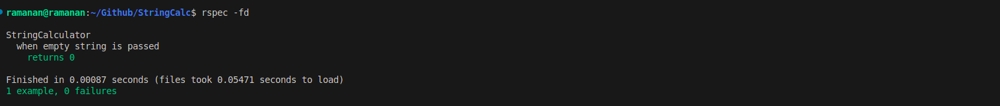

## StringCalculator Test Cases

| Context                                | Test Description                                             | Expected Behavior                                                               |
| -------------------------------------- | ------------------------------------------------------------ | ------------------------------------------------------------------------------- |
| **when empty string is passed** | Returns 0                                                    | Returns 0 when an empty string is provided.                                    |
| **when valid single digit number is passed** | Returns 2                                                    | Returns the single digit number when a valid single digit string is passed.    |
| **when valid 3 digit number is passed** | Returns 100                                                  | Returns the 3 digit number when a valid 3 digit number string is passed.     |
| **when , separated numbers string is passed** | Returns 6                                                    | Returns the sum of comma-separated numbers (e.g., "1,2,3" returns 6).          |
|                                        | Returns 300                                                  | Returns the sum of comma-separated numbers (e.g. "100,200" returns 300).        |
| **when custom delimiter is added** | Returns the sum of numbers separated by #                    | Returns the sum of numbers separated by a custom delimiter (e.g., "//#\n1#2#3"). |
|                                        | Returns the sum of numbers with more than 1 digit separated by # | Handles custom delimiters with multi-digit numbers.                                |
| **when -ve numbers are present in the string** | Raises error with single negative number                  | Raises an error when a single negative number is present.                         |
|                                        | Raises error with multiple negative number                | Raises an error when multiple negative numbers are present.                       |
| **when number greater than 1000 is present** | Ignores the number > 1000 and returns remaining sum       | Ignores numbers greater than 1000 when calculating the sum.                  |
|                                        | Raises error when number is negative                         | Still raises an error when negative numbers are present, even with numbers > 1000. |
| **when delimiters of any size** | Returns the sum as 6 if delimiter is *** | Handles custom delimiters of any length (e.g., "//[***]\n1***2***3").          |
|                                        | Returns the sum as 6 if delimiter is #####                  | Handles custom delimiters of any length (e.g., "//[#####]\n1#####2#####3").        |
| **when multiple delimiters are provided** | Handles multiple single-character delimiters               | Handles multiple single-character delimiters (e.g., "//[*][%]\n1*2%3").         |
|                                        | Handles multiple multi-character delimiters                | Handles multiple multi-character delimiters (e.g., "//[***][%%]\n1***2%%3").   |
|                                        | Handles a mix of single and multi-character delimiters       | Handles a mix of single and multi-character delimiters (e.g., "//[*][%%]\n1*2%%3"). |

### Screenshots

<figure>
  
  <figcaption>Empty string is passed, TDD Failed test case</figcaption>
</figure>

<figure>
  
  <figcaption>Empty string is passed, TDD Test Case fixed</figcaption>
</figure>

<figure>
  
  <figcaption>Non zero number string is passed, TDD Failed test case</figcaption>
</figure>

<figure>
  
  <figcaption>Non zero number string is passed, TDD Passed test case</figcaption>
</figure>

<figure>
  
  <figcaption>"," seperated string numbers passed, TDD Failed test case</figcaption>
</figure>

<figure>
  
  <figcaption>"," seperated string numbers passed, TDD Passed test case</figcaption>
</figure>

<figure>
  
  <figcaption>custom delimiter is pased in string, TDD Failed test case</figcaption>
</figure>

<figure>
  
  <figcaption>custom delimiter is pased in string, TDD Passed test case</figcaption>
</figure>

<figure>
  
  <figcaption>Negative Numbers are pased in string, TDD Failed test case</figcaption>
</figure>

<figure>
  
  <figcaption>Negative Numbers are pased in string, TDD Passed test case</figcaption>
</figure>

<figure>
  
  <figcaption>Number greater than 1000 is present in string, TDD Failed test case</figcaption>
</figure>

<figure>
  
  <figcaption>Number greater than 1000 is present in string, TDD Passed test case</figcaption>
</figure>

<figure>
  
  <figcaption>Multiple Character present in string, TDD Passed test case</figcaption>
</figure>

<figure>
  
  <figcaption>Multiple delimiters in string, TDD Faled test case</figcaption>
</figure>

<figure>
  
  <figcaption>Multiple delimiters in string, TDD Passed test case</figcaption>
</figure>